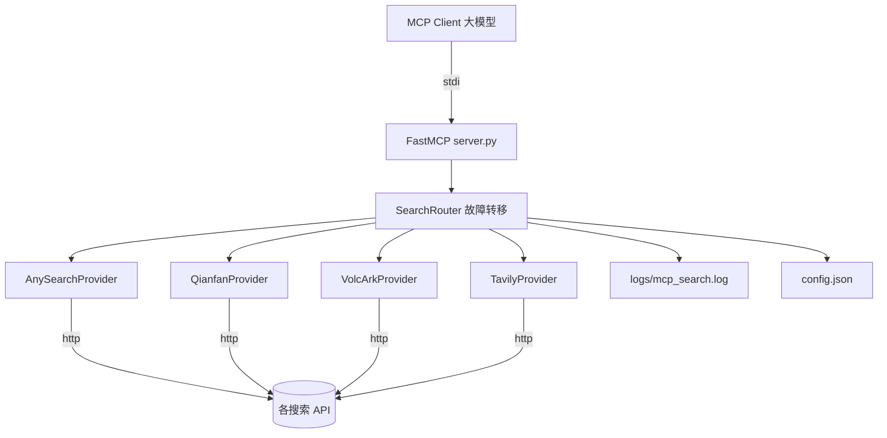

## 产品概述

在 d:\搜索MCP 下从零创建一个本地运行的 MCP 搜索服务（stdio 传输），供大模型客户端（Claude Desktop 等）接入调用。大模型调用 `search` 工具时，服务按配置顺序依次尝试 AnySearch、百度千帆搜索、火山引擎豆包搜索、Tavily 四个搜索源；任一节点失败（网络错误、超时、非 2xx、鉴权失败、配额耗尽）自动切换下一个，全部失败返回明确错误信息。

## 核心功能

- MCP 工具 `search(query, max_results)`：统一入口，返回标准化搜索结果（标题、URL、摘要）
- 多节点故障转移：按配置顺序尝试，单节点异常记录日志并切换，不影响整体请求
- JSON 配置驱动：config.json 配置各节点的启用状态、顺序、API Key、超时、重试次数（密钥从 说明.txt 迁移，说明.txt 保持不动）
- 文件日志：logs/mcp_search.log 记录每次节点调用与切换事件
- 交付要求：requirements.txt、README（含 MCP 客户端接入 JSON 片段）、lint + 单元测试（故障转移 mock 测试）+ 冒烟测试

## 边界与约束

- 不编辑 说明.txt；不修改项目外任何文件
- 单函数/变量名 ≤ 40 字符；单文件 ≤ 4800 行；命名遵循规范
- 全新项目，无老功能，风险面仅限本项目目录

## 技术栈

- 语言/运行时：Python 3.10+（Windows，PowerShell 执行）
- MCP 框架：官方 MCP Python SDK（FastMCP，`mcp` 包），stdio 传输
- HTTP 客户端：httpx（连接超时 + 读超时，异步）
- 日志：标准 logging，RotatingFileHandler 输出 logs/mcp_search.log
- 工具链：ruff（lint）、pytest（单元测试）

## 实现方案

分层架构，遵循 SoC 与开闭原则（新增搜索源只需新增 provider + 配置项）：



### 关键决策

- **stdio 传输**：本地大模型客户端通用性最高，无需暴露端口，安全可控
- **Provider 抽象**：统一 `SearchProvider` 基类（`name`、`search()`、统一返回 `SearchResult` 列表），Router 按配置顺序编排，新增节点零侵入
- **故障转移判定**：捕获 httpx.TimeoutException / TransportError、非 2xx 状态、鉴权失败(401/403)、配额耗尽(429) 均视为失败，日志记录后切换；连续失败节点可配置短时间熔断（内存缓存，避免每次都先撞已知坏节点）
- **性能**：异步串行尝试（保证配额节省，不并发轰炸全部节点）；单节点超时默认 10s；无状态请求，内存占用极小
- **配置迁移**：实现首步从 说明.txt 读取四个 API Key 写入 config.json（一次性，之后说明.txt 不再使用且不修改）

## 目录结构

```
d:\搜索MCP\
├── 说明.txt                  # 既有，[不动] 仅作密钥来源参考
├── config.json               # [NEW] 节点配置：order/enabled/api_key/timeout/retry
├── requirements.txt          # [NEW] mcp、httpx、pytest、ruff
├── README.md                 # [NEW] 运行方式 + MCP 客户端 mcpServers 接入片段
├── server.py                 # [NEW] FastMCP 入口，注册 search 工具，stdio 启动
├── config_loader.py          # [NEW] 读取/校验 config.json，生成 Provider 配置对象
├── search_router.py          # [NEW] 故障转移编排：按序尝试、熔断、聚合错误
├── logger.py                 # [NEW] RotatingFileHandler 日志初始化
├── providers/
│   ├── __init__.py           # [NEW] provider 注册表
│   ├── base.py               # [NEW] SearchProvider 抽象基类 + SearchResult 类型
│   ├── anysearch.py          # [NEW] AnySearch 适配器
│   ├── qianfan.py            # [NEW] 百度千帆 AI搜索适配器
│   ├── volc_ark.py           # [NEW] 火山方舟豆包搜索适配器
│   └── tavily.py             # [NEW] Tavily Search API 适配器
├── logs/                     # [NEW] 运行时生成 mcp_search.log
└── tests/
    └── test_router.py        # [NEW] 故障转移/全部失败/熔断 mock 单测
```

## 执行注意事项

- **API 端点核实**：实现各 provider 前，先用可用手段核实各搜索 API 的确切请求格式（Tavily: POST https://api.tavily.com/search 已知成熟；千帆/火山方舟/AnySearch 需查官方文档确认端点与鉴权头），文档地址见 说明.txt 中的控制台链接
- **日志规范**：记录节点名、耗时、状态码、失败原因；严禁记录完整 API Key（脱敏为前 8 位）；错误日志附带可操作信息
- **密钥安全**：config.json 属本地私有文件，不进版本库（添加 .gitignore）
- **冒烟测试**：PowerShell 下用 MCP 客户端或直接脚本调用 search 工具，验证至少一个真实源返回结果，其余源 mock 验证切换
- **Windows 兼容**：stdio 编码显式 UTF-8，避免中文 query 乱码

## 关键代码结构

```python
class SearchProvider(ABC):
    name: str
    def __init__(self, cfg: ProviderConfig) -> None: ...
    @abstractmethod
    async def search(self, query: str, max_results: int) -> list[SearchResult]: ...

@dataclass
class SearchResult:
    title: str
    url: str
    snippet: str
    source: str

async def run_search_with_failover(
    query: str, providers: list[SearchProvider]
) -> list[SearchResult]: ...
```